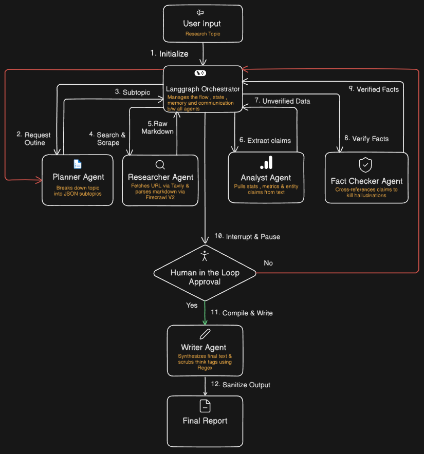
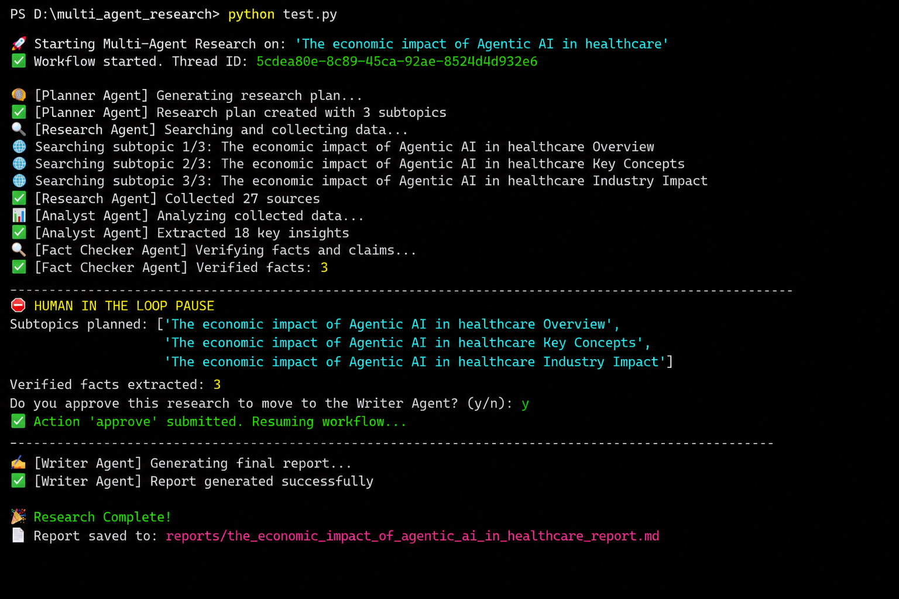

# AgentMind - Multi-Agent Research & Report Generation System

**Overview**

AgentMind is a LangGraph-based Multi-Agent Research & Report Generation System designed to automate the end-to-end research workflow. The system employs five specialized AI agents: Planner, Researcher, Analyst, Fact Checker, and Writer that collaborate through a shared state to transform a user-defined topic into a structured, fact-verified research report.

Using Tavily Search for web discovery, Firecrawl for content extraction, and Qwen3 14B via Ollama for local inference, the system performs autonomous research, information analysis, claim validation, and report generation while maintaining reliability through a Human-in-the-Loop (HITL) approval stage. The result is an automated research pipeline capable of producing comprehensive and structured reports from live web data.

## Features

* LangGraph-based orchestration enabling seamless collaboration between five specialized AI agents.
* Shared-state architecture for maintaining context and information flow across the research pipeline.
* Human-in-the-Loop (HITL) approval workflow for controlled and transparent report generation.
* Automated fact-verification pipeline to improve the reliability of generated insights.
* Zero-cost local inference using Qwen3 14B via Ollama, eliminating dependency on paid LLM APIs.

**Project Structure**

## 📂 Project Structure

```text
multi_agent_research/
├── agents/                  # Core LangGraph agent definitions
│   ├── analyst.py           # Isolates metrics and claims from raw markdown
│   ├── fact_checker.py      # Cross-references claims to mitigate hallucinations
│   ├── planner.py           # Breaks down topics into structured JSON subtopics
│   ├── researcher.py        # Executes web discovery via external search APIs
│   └── writer.py            # Synthesizes reports & applies regex sanitization
├── api/                     # Backend API infrastructure
│   └── main.py              # FastAPI REST endpoints
├── graph/                   # State machine orchestrator
│   └── workflow.py          # Central routing logic and conditional edges
├── reports/                 # Output directory for finalized research files
├── services/                # External API and local tool integrations
│   ├── firecrawl_service.py # Firecrawl V2 web scraping logic
│   ├── ollama_service.py    # Local Qwen 14B inference engine connections
│   ├── pdf_generator.py     # Final report PDF export functionality
│   └── tavily_service.py    # Web search and routing logic
├── state/                   # Shared memory and type definitions
│   └── research_state.py    # State schemas passed between LangGraph nodes
├── tests/                   # Automated testing suite
│   └── test_workflow.py     # Integration tests for graph execution
├── .env                     # Environment variables (API keys)
├── .gitignore               # Git ignore rules
├── docker-compose.yml       # Container orchestration configuration
├── Dockerfile               # Container image blueprint
├── README.md                # Project documentation
├── requirements.txt         # Python dependencies
└── test.py                  # Main CLI entry point and execution script 
```

**Workflow**

The following image illustrates the complete workflow of the proposed system, detailing the cyclic data flow between the central orchestrator and the specialized agents.




**Technologies Used**

* **Python** – Core programming language used for project development.
* **LangGraph** – State machine orchestration, agent routing, and memory persistence.
* **LangChain** – LLM standard wrappers and prompt formatting.
* **Ollama (Qwen 14B)** – Local inference engine providing zero-cost reasoning capabilities.
* **Tavily API** – Automated web search discovery.
* **Firecrawl V2 API** – Live web parsing and markdown generation.
* **Python Regex (`re`)** – Post-processing filter to strip internal `<think>` tags from the final model output.

Here is the cleaned-up, properly formatted version of those instructions. You can copy and paste this directly into your `README.md` to replace the old execution section.

It organizes everything logically so anyone visiting your repository knows exactly what to do step-by-step.

---

## Quick Start & Execution

Follow these steps to configure and run the multi-agent pipeline on your local machine.

### 1. Install Dependencies

Ensure you are in the project root directory, then install all required Python packages:

```bash
pip install -r requirements.txt

```

### 2. Configure Environment

Create a `.env` file in the root directory and add your API keys:

```env
TAVILY_API_KEY=your_tavily_key               --> Source: [Tavily Search API](https://www.tavily.com/)
FIRECRAWL_API_KEY=your_firecrawl_key         --> Source: [Firecrawl](https://www.firecrawl.dev/)

```

### 3. Run the Project

To properly initialize the backend, the API, and the orchestrator, you will need to run the following commands in **three separate terminal windows**:

**Terminal 1: Start the Local Inference Engine**
Pull and run the Qwen 14B reasoning model via Ollama to run locally in the background.

```powershell
ollama pull qwen:14b                 --> one time download (~ 10 GB)

```

**Terminal 2: Start the Backend API**
Start the Uvicorn server to serve your LangGraph agents.

```powershell
uvicorn api.main:app --reload

```

**Terminal 3: Launch the Pipeline**
Run the main script to initialize the LangGraph orchestrator and start the research process.

```powershell
python test.py

```

**Output**



**Terminal Dashboard**
Interactive CLI output displaying real-time status updates as the agents progress through the state graph, complete with the HITL interrupt prompt.
For new domain research : Change the topic in test.py